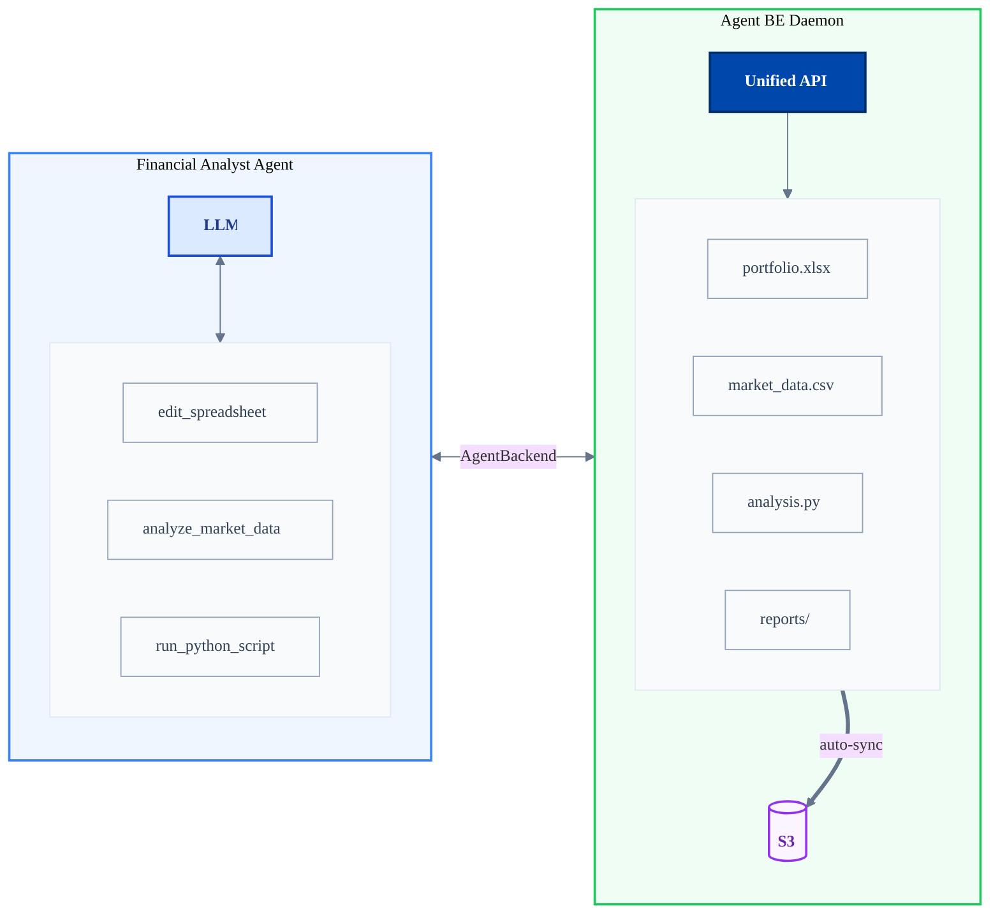
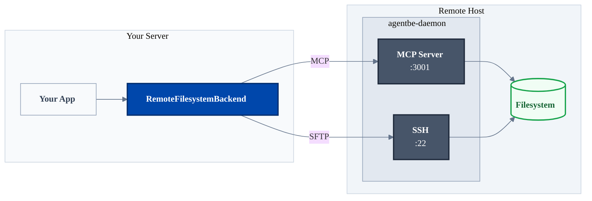

# Agent Backend

**A plug-and-play memory and code execution backend for deep AI agents.**

Give your AI agents a single, unified interface to interact with a filesystem backend supporting:

- Code execution on a fully POSIX-compliant system
- Persistent storage
- Isolated sub-environments for multitenancy
- Sync to remote storage options including S3.

Also supports MCP (Model Context Protocol) and adapters for plug-and-play with leading AI agent SDKs.

[](https://badge.fury.io/js/agent-backend)
[](https://choosealicense.com/licenses/mit/)

## Why Use a Unified Backend?

Deep agents that use long-running or background processes need a reliable way to persist state. Many agents also benefit from shell access for tools like grep and find, plus the ability to execute code for scripting. To get all this, you need a POSIX-compatible filesystem.

There are two ways to do this:
1. **Run your agent in the same VM as the filesystem.** This sucks because:
  * It's a scaling and security liability since you deploy your agent across thousands of VMs
  * You have to separate your agent and app server code. That means a lot more APIs and boilerplate.
2. **Run your agent as part of your app server**, and have it talk to your VM remotely.

Agent Backend achieves the latter, with a single API for filesystem operations. Use a scalable, distributed filesystem backend just like you would use a MongoDB or ElasticSearch cluster.

```typescript
function getBackend() {
  if (environment.isDevelopment) {
    return new LocalFilesystemBackend({
      rootDir: '/tmp/workspace'
    });
  } else {
    new RemoteFilesystemBackend({
      rootDir: '/var/workspace',
      host: 'host1.yoursite.com',
      ...
    });
  }
}
await getBackend().exec(...);
```

**Available backends:**
- **Filesystem** - Execute code, run commands, manage files
- **Memory** - Fast in-memory key/value storage.
- **Database** *(coming soon)* - Structured data and queries

Agent Backends run in a sandboxed environment to ensure isolation and security, with options including Docker container and remote VM isolation.



**Agent Backend abstracts the memory layer entirely** — your agent's tools interact with a single API while the backend handles file persistence, code execution, and automatic cloud sync.

## Table of Contents

- [Quick Start](#quick-start)
- [Usage](#usage)
  - [Scoped Access](#scoped-access)
  - [MCP Integration](#mcp-integration)
  - [Security & Isolation](#security--isolation)
- [Integration with Agent SDKs](#integration-with-agent-sdks)
  - [Vercel AI SDK](#vercel-ai-sdk)
- [Backend Connection Pooling](#backend-connection-pooling)
- [Server Deployment](#server-deployment)
- [Advanced Features](#advanced-features)
- [Examples](#examples)
- [Error Handling](#error-handling)
- [TypeScript Support](#typescript-support)
- [Documentation](#documentation)
- [Development](#development)
- [License](#license)

---

## Quick Start

```bash
npm install agent-backend
```

### Memory Backend

Perfect for agent state, caching, and temporary data:

```typescript
import { MemoryBackend } from 'agent-backend'

const memory = new MemoryBackend()

await memory.write('session/user123/state', JSON.stringify({ step: 2 }))
const state = await memory.read('session/user123/state')
const sessions = await memory.list('session/')
```

### Filesystem Backend - Local

Execute code and manage files locally:

```typescript
import { LocalFilesystemBackend } from 'agent-backend'

const backend = new LocalFilesystemBackend({
  rootDir: '/tmp/workspace'
})

await backend.exec('git clone https://github.com/user/repo.git .')
await backend.exec('npm install')
const output = await backend.exec('npm run build')

await backend.write('config.json', JSON.stringify({ version: '1.0' }))
const files = await backend.readdir('src')
```

### Filesystem Backend - Remote

Same API, operations run on a remote server via SSH:

```typescript
import { RemoteFilesystemBackend } from 'agent-backend'

const backend = new RemoteFilesystemBackend({
  rootDir: '/var/workspace',
  host: 'build-server.example.com',
  sshAuth: {
    type: 'password',
    credentials: { username: 'agent', password: 'secure-pass' }
  }
})

// Same operations, executed remotely
await backend.exec('python script.py')
```

### MCP Integration

Use Model Context Protocol for standardized agent integration. Each backend offers the option to create an MCP client to provide the full set of tools for backend access to the agent.

```typescript
const backend = new LocalFilesystemBackend({
  rootDir: '/tmp/workspace'
})

// Get MCP client
const mcp = await backend.getMCPClient()

// Use MCP tools
const result = await mcp.callTool({
  name: 'exec',
  arguments: { command: 'npm install' }
})

// Expose tools to the agent
const backendTools = await mcp.tools()
agent.run({
  tools: backendTools,
  ...
})

await mcp.close()
```

### The Agent Backend Daemon

For remote execution, the **agentbe-daemon** runs on a remote host and provides both MCP and SSH access. Your application connects via `RemoteFilesystemBackend`, which handles all the protocol details.



The daemon can run in Docker or directly on a VM. See [Deploying the Agent Backend Daemon](#deploying-the-agent-backend-daemon) for setup.

---

## Usage

### Scoped Access

Create isolated scopes for multi-tenancy:

```typescript
const backend = new LocalFilesystemBackend({
  rootDir: '/var/workspace'
})

// Each user gets an isolated scope
const user1 = backend.scope('users/user1')
const user2 = backend.scope('users/user2')

await user1.exec('npm install')  // isolated to users/user1/
await user2.exec('git init')     // isolated to users/user2/

// Scopes can be nested
const project = user1.scope('projects/my-app')
await project.exec('npm test')
```

**Scopes provide:**
- Path convenience (operations are relative)
- Safety (can't escape the scope)
- Isolation (OS-level when available)

**Scoped MCP Access:**

```typescript
// MCP client scoped to specific directory
const mcp = await backend.getMCPClient('users/user1/projects/my-app')
```

### Security & Isolation

Agent Backend provides automatic isolation for safe multi-tenant operations.

**Isolation Levels:**

By default, `isolation: 'auto'` detects and uses the best available method:

1. **Bubblewrap** (Linux) - OS-level namespace isolation, no root needed
2. **Software** - Heuristics-based protection using path validation and dangerous operation blocking

```typescript
const backend = new LocalFilesystemBackend({
  rootDir: '/var/workspace',
  isolation: 'auto'  // default - uses bubblewrap if available
})
```

**Dangerous Operation Protection:**

Dangerous commands are blocked by default:

```typescript
await backend.exec('rm -rf /')      // ❌ Blocked
await backend.exec('sudo apt-get')  // ❌ Blocked
await backend.exec('curl ... | sh') // ❌ Blocked
```

Disable for trusted environments:

```typescript
const backend = new LocalFilesystemBackend({
  rootDir: '/var/workspace',
  preventDangerous: false  // allow all operations
})
```

---

## Integration with Agent SDKs

### Vercel AI SDK

Agent Backend provides seamless integration with Vercel's AI SDK through the `VercelAIAdapter`. The adapter automatically creates the appropriate MCP transport based on your backend type:

- **LocalFilesystemBackend** → Stdio transport (spawns subprocess)
- **RemoteFilesystemBackend** → HTTP transport (connects to remote MCP server)
- **MemoryBackend** → Stdio transport (spawns subprocess)

```typescript
import { experimental_createMCPClient as createMCPClient } from '@ai-sdk/mcp'
import { LocalFilesystemBackend, VercelAIAdapter } from 'agent-backend'
import { generateText } from 'ai'
import { openai } from '@ai-sdk/openai'

// Create backend and adapter
const backend = new LocalFilesystemBackend({ rootDir: '/tmp/workspace' })
const adapter = new VercelAIAdapter(backend)

// Get transport and create AI SDK MCP client
const transport = await adapter.getTransport()
const mcp = await createMCPClient({ transport })

// Tools are already in AI SDK format - no manual transformation needed
const result = await generateText({
  model: openai('gpt-4'),
  tools: await mcp.tools(),
  prompt: 'List all TypeScript files in src/'
})

await mcp.close()
```

---

## Backend Connection Pooling

For stateless web servers, agent backend offers built-in backend pooling for managing connections with multiple hosts. This is particularly useful for distributed backend contexts (e.g. one host per user or organization).

```typescript
import { BackendPoolManager } from 'agent-backend'

const pool = new BackendPoolManager({
  backendClass: RemoteFilesystemBackend,
  defaultConfig: {
    rootDir: '/var/workspace',
    host: 'build-server.example.com',
    sshAuth: { type: 'password', credentials: { username: 'agent', password: 'pass' } }
  }
})

// Callback pattern (automatic cleanup)
app.post('/api/build', async (req, res) => {
  const output = await pool.withBackend(
    { userId: req.user.id },
    async (backend) => {
      const projectBackend = backend.scope(`projects/${req.body.projectId}`)
      return await projectBackend.exec('npm run build')
    }
  )
  res.json({ output })
})

// Graceful shutdown
process.on('SIGTERM', () => pool.destroyAll())
```

---

## Deploying the Agent Backend Daemon

### Docker (Recommended)

Start agentbe-daemon in Docker with a single command:

```bash
# Install agent-backend CLI
npm install -g agent-backend

# Start Docker container with agentbe-daemon
agent-backend start-docker

# Stop the container
agent-backend stop-docker
```

This starts a container with:
- **SSH daemon** on port 2222 (for direct file operations)
- **MCP server** on port 3001 (for tool execution)
- **Default credentials**: `root:agents`

Connect from your application:

```typescript
import { RemoteFilesystemBackend } from 'agent-backend'

const backend = new RemoteFilesystemBackend({
  rootDir: '/var/workspace',
  host: 'localhost',
  sshPort: 2222,
  mcpPort: 3001,
  sshAuth: {
    type: 'password',
    credentials: { username: 'root', password: 'agents' }
  }
})

await backend.connect()
await backend.exec('npm install')
```

### Local-Only Mode

For local development without Docker (works on macOS/Windows):

```bash
# Start agentbe-daemon in local-only mode (stdio MCP, no SSH)
agent-backend daemon --rootDir /tmp/workspace --local-only
```

### Cloud Deployment

See [typescript/deploy/README.md](./typescript/deploy/README.md) for cloud VM deployment options.

---

## Advanced Features

### Environment Variables

```typescript
const scopedBackend = backend.scope('projects/my-app', {
  env: {
    NODE_ENV: 'production',
    API_KEY: 'secret',
    DATABASE_URL: 'postgres://...'
  }
})

await scopedBackend.exec('npm run build')  // uses custom env
```

### Operations Logging

```typescript
import { ConsoleOperationsLogger } from 'agent-backend'

const scopedBackend = backend.scope('project', {
  operationsLogger: new ConsoleOperationsLogger()
})

await scopedBackend.exec('npm install')
// Logs: [AgentBackend] exec: npm install
```

### Binary Data

```typescript
const imageData = await backend.read('logo.png', { encoding: 'buffer' })
const tarball = await backend.exec('tar -czf - .', { encoding: 'buffer' })
```

### Timeouts

```typescript
const backend = new RemoteFilesystemBackend({
  rootDir: '/tmp/workspace',
  host: 'server.com',
  sshAuth: { ... },
  operationTimeoutMs: 300000,  // 5 minutes
  maxOutputLength: 10 * 1024 * 1024  // 10MB
})
```

---

## Examples

### Code Execution Sandbox

```typescript
const sandbox = new LocalFilesystemBackend({
  rootDir: '/tmp/workspace',
  isolation: 'auto'
})

const userCodeBackend = sandbox.scope(`users/${userId}`)
await userCodeBackend.write('script.js', untrustedCode)
const result = await userCodeBackend.exec('node script.js')
```

### Multi-tenant SaaS

```typescript
// Separate backend per organization
const org1Backend = new RemoteFilesystemBackend({
  rootDir: '/var/saas/org1',
  host: 'org1-server.example.com',
  sshAuth: { ... }
})

const org2Backend = new RemoteFilesystemBackend({
  rootDir: '/var/saas/org2',
  host: 'org2-server.example.com',
  sshAuth: { ... }
})

// Scoped backends per user within each org
const org1User1 = org1Backend.scope('users/user1')
const org1User2 = org1Backend.scope('users/user2')

const org2User1 = org2Backend.scope('users/user1')
const org2User2 = org2Backend.scope('users/user2')
```

### Agent State Management

```typescript
const state = new MemoryBackend()

await state.write('agents/agent1/current-task', 'building')
await state.write('agents/agent1/progress', '50%')

const allAgents = await state.list('agents/')
```

---

## Error Handling

```typescript
import { BackendError, DangerousOperationError } from 'agent-backend'

try {
  await backend.exec('rm -rf /')
} catch (error) {
  if (error instanceof DangerousOperationError) {
    console.log('Blocked:', error.operation)
  } else if (error instanceof BackendError) {
    console.log('Error:', error.message)
  }
}
```

---

## TypeScript Support

Full type definitions included:

```typescript
import type {
  LocalFilesystemBackend,
  RemoteFilesystemBackend,
  MemoryBackend,
  ScopedBackend
} from 'agent-backend'

const backend: LocalFilesystemBackend = new LocalFilesystemBackend({
  rootDir: '/tmp/workspace'
})

const scopedBackend: ScopedBackend<LocalFilesystemBackend> = backend.scope('project')
```

---

## Documentation

- [Architecture](docs/architecture.md)
- [Security & Isolation](docs/security.md)
- [Performance](docs/performance.md)

---

## Development

This is a multi-language monorepo (TypeScript + Python). Use Makefile for all commands:

```bash
make help           # Show all available commands
make install        # Install dependencies (including mprocs)
make build          # Build all packages
make test           # Run all tests
make typecheck      # Type check everything
make dev            # Start dev environment with mprocs TUI
```

See [CONTRIBUTING.md](CONTRIBUTING.md) for detailed development setup, workflows, Docker commands, and troubleshooting.

---

## License

MIT - see [LICENSE](LICENSE) file for details.

---

**Agent Backend**: The right backend for every agent task.
