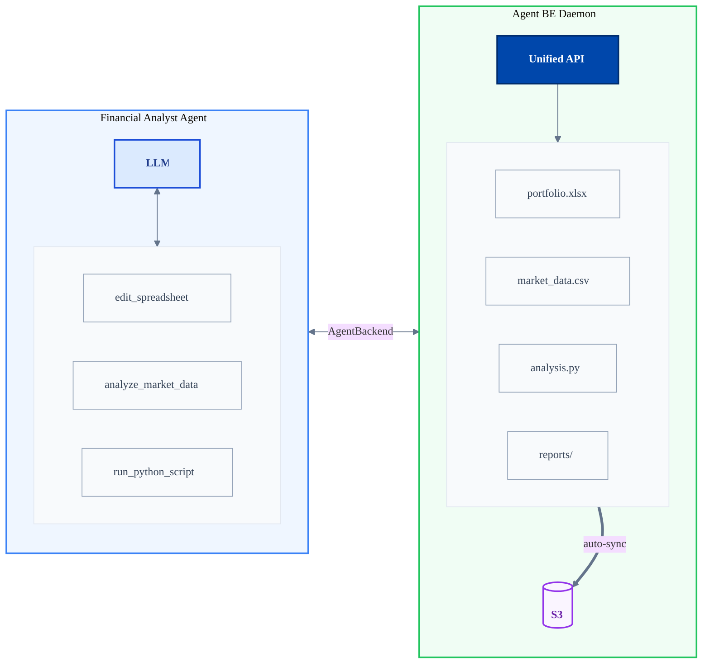
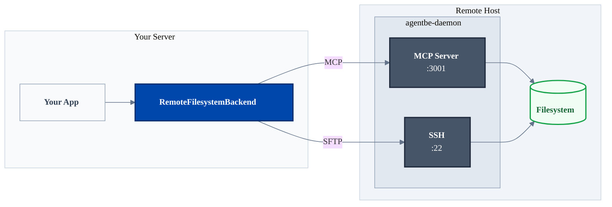

<p align="center">
  
</p>

<p align="center">
  <b>--An open-source remote filesystem backend for deep AI agents--</b>
</p>

---

The secret sauce behind effective deep AI agents like Claude Code and Manus is a POSIX-compliant filesystem for memory, file manipulation, shell access, and code execution.

**Agent Backend is a client library + server-side daemon that provides a single API for agent-filesystem interaction within a remote sandbox.** It allows usage of a scalable, distributed filesystem backend just as easily as using MongoDB or Postgres - and it's just as easy to self-host.

[](https://badge.fury.io/js/agent-backend)
[](https://badge.fury.io/py/agent-backend)
[](https://choosealicense.com/licenses/apache-2.0/)

## How do I use it?

In your agent:

<details open>
<summary>TypeScript</summary>

```bash
npm install agent-backend
```

</details>

<details>
<summary>Python</summary>

```bash
pip install agent-backend
```

</details>

Agent Backend supports:
- Long-lived sessions with object storage backing for session durability
- OCI compatible - bring your own Dockerfile
- Isolated sub-environments for multitenancy per backend instance
- MCP (Model Context Protocol) filesystem API (based on the official Filesystem MCP by Anthropic) + direct SSH access
- Adapters for plug-and-play with leading AI agent SDKs.

**Available backends:**

| Backend | Description |
|---------|-------------|
| **Memory** | Fast in-memory key/value storage with filesystem semantics |
| **Local Filesystem** | Execute code, run commands, manage files |
| **Remote Filesystem** | Filesystem on a remote host or Docker container |
| **K8s** *(coming soon)* | Fully managed, multi-tenant filesystem backend in a VPC |

Agent Backends run in a sandboxed environment to ensure isolation and security, with options including Docker container and remote VM isolation.



## Table of Contents

- [Quick Start](#quick-start)
- [Usage](#usage)
  - [Scoped Access](#scoped-access)
  - [Security & Isolation](#security--isolation)
  - [Resource Cleanup](#resource-cleanup)
- [Integration with Agent SDKs](#integration-with-agent-sdks)
- [Examples](#examples)
- [Deploying the Agent Backend Daemon](#deploying-the-agent-backend-daemon)
- [Documentation](#documentation)
- [Development](#development)
- [License](#license)

---

## Quick Start

Write your code the same way, whether your agent is acting on your local machine or on a VM in a distributed Kubernetes cluster.

<details open>
<summary>TypeScript</summary>

```bash
await backend.write("hello.txt", "Hello World!")
```

</details>

<details>
<summary>Python</summary>

```bash
await backend.write("hello.txt", "Hello World!")
```

</details>

On your remote VM or container, run the agentbe-daemon:

```bash
npm install -g agent-backend

# Start full daemon (Linux only, requires root)
agent-backend daemon --rootDir /var/workspace --auth-token $SECRET

# Or use Docker
agent-backend start-docker
```

You now have full access to the VM instance at port 3001, sandboxed to `rootDir`.

<details open>
<summary>TypeScript</summary>

```typescript
function getBackend() {
  if (environment.isDevelopment) {
    return new LocalFilesystemBackend({
      rootDir: '/tmp/agentbe-workspace'
    });
  } else {
    new RemoteFilesystemBackend({
      rootDir: '/var/workspace',
      host: 'host1.yoursite.com',
      authToken: SECRET
    });
  }
}
await getBackend().exec(...);
```

</details>

<details>
<summary>Python</summary>

```python
from agent_backend import (
    LocalFilesystemBackend, LocalFilesystemBackendConfig,
    RemoteFilesystemBackend, RemoteFilesystemBackendConfig,
)

def get_backend():
    if environment.is_development:
        return LocalFilesystemBackend(LocalFilesystemBackendConfig(
            root_dir="/tmp/agentbe-workspace"
        ))
    else:
        return RemoteFilesystemBackend(RemoteFilesystemBackendConfig(
            root_dir="/var/workspace",
            host="host1.yoursite.com",
            auth_token=SECRET
        ))

await get_backend().exec(...)
```

</details>

### Memory Backend

Lightweight  agent state, caching, and temporary data:

<details open>
<summary>TypeScript</summary>

```typescript
import { MemoryBackend } from 'agent-backend'

const memory = new MemoryBackend()

await memory.write('session/user123/state', JSON.stringify({ step: 2 }))
const state = await memory.read('session/user123/state')
const sessions = await memory.list('session/')
```

</details>

<details>
<summary>Python</summary>

```python
from agent_backend import MemoryBackend

memory = MemoryBackend()

await memory.write("session/user123/state", '{"step": 2}')
state = await memory.read("session/user123/state")
sessions = await memory.list_keys("session/")
```

</details>

### Filesystem Backend - Local

Execute code and manage files locally:

<details open>
<summary>TypeScript</summary>

```typescript
import { LocalFilesystemBackend } from 'agent-backend'

const backend = new LocalFilesystemBackend({
  rootDir: '/tmp/agentbe-workspace'
})

await backend.exec('git clone https://github.com/user/repo.git .')
await backend.exec('npm install')
const output = await backend.exec('npm run build')

await backend.write('config.json', JSON.stringify({ version: '1.0' }))
const files = await backend.readdir('src')
```

</details>

<details>
<summary>Python</summary>

```python
from agent_backend import LocalFilesystemBackend, LocalFilesystemBackendConfig

backend = LocalFilesystemBackend(LocalFilesystemBackendConfig(
    root_dir="/tmp/agentbe-workspace"
))

await backend.exec("git clone https://github.com/user/repo.git .")
await backend.exec("pip install -r requirements.txt")
output = await backend.exec("python -m pytest")

await backend.write("config.yaml", "version: '1.0'")
files = await backend.readdir("src")
```

</details>

### Filesystem Backend - Remote

Same API, operations run on a remote server via SSH:

<details open>
<summary>TypeScript</summary>

```typescript
import { RemoteFilesystemBackend } from 'agent-backend'

const backend = new RemoteFilesystemBackend({
  rootDir: '/var/workspace',
  host: 'build-server.example.com',
  sshAuth: {
    type: 'password',
    credentials: { username: 'agent', password: 'secure-pass' }
  }
})

// Same operations, executed remotely
await backend.exec('python script.py')
```

</details>

<details>
<summary>Python</summary>

```python
from agent_backend import RemoteFilesystemBackend, RemoteFilesystemBackendConfig

backend = RemoteFilesystemBackend(RemoteFilesystemBackendConfig(
    root_dir="/var/workspace",
    host="build-server.example.com",
    auth_token="secure-token",
))

# Same operations, executed remotely
await backend.exec("python script.py")
```

</details>

### MCP Integration

Use Model Context Protocol for standardized agent integration. Each backend offers the option to create an MCP client to provide the full set of tools for backend access to the agent.

<details open>
<summary>TypeScript</summary>

```typescript
const backend = new LocalFilesystemBackend({
  rootDir: '/tmp/agentbe-workspace'
})

// Get MCP client
const mcp = await backend.getMCPClient()

// Use MCP tools
const result = await mcp.callTool({
  name: 'exec',
  arguments: { command: 'npm install' }
})

// Expose tools to the agent
const backendTools = await mcp.tools()
agent.run({
  tools: backendTools,
  ...
})

// destroy() closes MCP clients, transports, and cleans up resources
await backend.destroy()
```

</details>

<details>
<summary>Python</summary>

```python
from agent_backend import LocalFilesystemBackend, LocalFilesystemBackendConfig

backend = LocalFilesystemBackend(LocalFilesystemBackendConfig(
    root_dir="/tmp/agentbe-workspace"
))

# Get MCP client
mcp = await backend.get_mcp_client()

# Use MCP tools
result = await mcp.call_tool("exec", {"command": "pip install -r requirements.txt"})

# Expose tools to the agent
tools_result = await mcp.list_tools()
backend_tools = tools_result.tools

# destroy() closes MCP clients, transports, and cleans up resources
await backend.destroy()
```

</details>

### The Agent Backend Daemon

For remote execution, the **agentbe-daemon** runs on a remote host and provides both MCP and SSH access. Your application connects via `RemoteFilesystemBackend`, which handles all the protocol details.



The daemon can run in Docker or directly on a VM. See [Deploying the Agent Backend Daemon](#deploying-the-agent-backend-daemon) for setup.

---

## Usage

### Scoped Access

Create isolated scopes for multi-tenancy:

<details open>
<summary>TypeScript</summary>

```typescript
const backend = new LocalFilesystemBackend({
  rootDir: '/var/workspace'
})

// Each user gets an isolated scope
const user1 = backend.scope('users/user1')
const user2 = backend.scope('users/user2')

await user1.exec('npm install')  // isolated to users/user1/
await user2.exec('git init')     // isolated to users/user2/

// Scopes can be nested
const project = user1.scope('projects/my-app')
await project.exec('npm test')
```

</details>

<details>
<summary>Python</summary>

```python
from agent_backend import LocalFilesystemBackend, LocalFilesystemBackendConfig

backend = LocalFilesystemBackend(LocalFilesystemBackendConfig(
    root_dir="/var/workspace"
))

# Each user gets an isolated scope
user1 = backend.scope("users/user1")
user2 = backend.scope("users/user2")

await user1.exec("pip install -r requirements.txt")  # isolated to users/user1/
await user2.exec("git init")                         # isolated to users/user2/

# Scopes can be nested
project = user1.scope("projects/my-app")
await project.exec("python -m pytest")
```

</details>

**Scopes provide:**
- Path convenience (operations are relative)
- Safety (can't escape the scope)
- Isolation (OS-level when available)

**Scoped MCP Access:**

<details open>
<summary>TypeScript</summary>

```typescript
// MCP client scoped to specific directory
const mcp = await backend.getMCPClient('users/user1/projects/my-app')
```

</details>

<details>
<summary>Python</summary>

```python
mcp = await backend.get_mcp_client("users/user1/projects/my-app")
```

</details>

### Security & Isolation

Agent Backend provides automatic isolation for safe multi-tenant operations.

**Isolation Levels:**

By default, `isolation: 'auto'` detects and uses the best available method:

1. **Bubblewrap** (Linux) - OS-level namespace isolation, no root needed
2. **Software** - Heuristics-based protection using path validation and dangerous operation blocking

<details open>
<summary>TypeScript</summary>

```typescript
const backend = new LocalFilesystemBackend({
  rootDir: '/var/workspace',
  isolation: 'auto'  // default - uses bubblewrap if available
})
```

</details>

<details>
<summary>Python</summary>

```python
from agent_backend import LocalFilesystemBackend, LocalFilesystemBackendConfig, IsolationMode

backend = LocalFilesystemBackend(LocalFilesystemBackendConfig(
    root_dir="/var/workspace",
    isolation=IsolationMode.AUTO,  # default - uses bubblewrap if available
))
```

</details>

**Dangerous Operation Protection:**

Dangerous commands are blocked by default:

<details open>
<summary>TypeScript</summary>

```typescript
await backend.exec('rm -rf /')      // ❌ Blocked
await backend.exec('sudo apt-get')  // ❌ Blocked
await backend.exec('curl ... | sh') // ❌ Blocked
```

</details>

<details>
<summary>Python</summary>

```python
await backend.exec("rm -rf /")      # Blocked
await backend.exec("sudo apt-get")  # Blocked
await backend.exec("curl ... | sh") # Blocked
```

</details>

Disable for trusted environments:

<details open>
<summary>TypeScript</summary>

```typescript
const backend = new LocalFilesystemBackend({
  rootDir: '/var/workspace',
  preventDangerous: false  // allow all operations
})
```

</details>

<details>
<summary>Python</summary>

```python
backend = LocalFilesystemBackend(LocalFilesystemBackendConfig(
    root_dir="/var/workspace",
    prevent_dangerous=False,  # allow all operations
))
```

</details>

### Resource Cleanup

Calling `backend.destroy()` automatically closes all MCP clients and transports created through `getMCPClient()`, `getMCPTransport()`, or `VercelAIAdapter.getMCPClient()`. No manual cleanup of those resources is needed.

<details open>
<summary>TypeScript</summary>

```typescript
const backend = new LocalFilesystemBackend({ rootDir: '/tmp/agentbe-workspace' })
const mcp = await backend.getMCPClient()

// ... use MCP tools ...

// Closes MCP clients, SSH/WS connections, and cleans up all resources
await backend.destroy()
```

</details>

<details>
<summary>Python</summary>

```python
from agent_backend import LocalFilesystemBackend, LocalFilesystemBackendConfig

backend = LocalFilesystemBackend(LocalFilesystemBackendConfig(
    root_dir="/tmp/agentbe-workspace"
))
mcp = await backend.get_mcp_client()

# ... use MCP tools ...

# Closes MCP clients, SSH/WS connections, and cleans up all resources
await backend.destroy()
```

</details>

Register external closeable resources with `trackCloseable()`:

<details open>
<summary>TypeScript</summary>

```typescript
backend.trackCloseable(myCustomResource)  // will be closed on destroy()
```

</details>

<details>
<summary>Python</summary>

```python
backend.track_closeable(my_custom_resource)  # will be closed on destroy()
```

</details>

---

## Integration with Agent SDKs

Agent Backend integrates with leading AI agent frameworks via adapters that expose backend tools in the format each SDK expects.

- **[Vercel AI SDK](docs/ai-sdk.md)** -- `VercelAIAdapter` wraps any backend and provides AI SDK-compatible MCP tools

---

## Examples

- **[NextJS Demo](examples/NextJS/README.md)** -- Full-featured web app with AI chat, file management, and code editing
- **[TSBasic Demo](examples/TSBasic/README.md)** -- Minimal CLI chat with MCP tools in a terminal (TypeScript)
- **[PyBasic Demo](examples/PyBasic/README.md)** -- Minimal CLI chat with MCP tools in a terminal (Python)

---

## Deploying the Agent Backend Daemon

For remote execution, the agentbe-daemon runs on a remote host and provides MCP and SSH access. It supports local-only mode (stdio, for development), full daemon mode (HTTP + SSH, for production), and Docker deployment.

See [docs/agentbe-daemon.md](./docs/agentbe-daemon.md) for setup, configuration, scoping, and deployment options.

---

## Additional Documentation

- [Architecture](docs/architecture.md)
- [Agent Backend Daemon](docs/agentbe-daemon.md)
- [AI SDK Integration](docs/ai-sdk.md)
- [Connection Pooling](docs/connection-pooling.md)
- [Security & Isolation](docs/security.md)
- [Performance](docs/performance.md)
- [TypeScript Client Library](typescript/README.md)
- [Python Client Library](python/README.md)

---

## Development

This is a multi-language monorepo (TypeScript + Python). Use Makefile for all commands:

```bash
make help           # Show all available commands
make install        # Install dependencies (including mprocs)
make build          # Build all packages
make test           # Run all tests
make typecheck      # Type check everything
make dev            # Start dev environment with mprocs TUI
```

See [CONTRIBUTING.md](CONTRIBUTING.md) for detailed development setup, workflows, Docker commands, and troubleshooting.

---

## License

Apache 2.0 - see [LICENSE](LICENSE) file for details.
