# Agent Backend Architecture

## Overview

Agent Backend provides secure, isolated filesystem access and command execution for AI agents. It supports both local and remote deployments with a unified interface.

**Core Concepts:**
- **Backends** - Client-side interfaces for filesystem operations (LocalFilesystemBackend, RemoteFilesystemBackend, MemoryBackend)
- **MCP (Model Context Protocol)** - Standardized protocol for AI tool execution
- **agentbe-daemon** - Server process that manages MCP and optionally SSH services
- **Scoping** - Isolation mechanism for multi-tenancy

---

## Backend Types

### LocalFilesystemBackend
- Direct filesystem access using Node.js APIs (fs, child_process)
- Optional MCP HTTP server for tool exposure to AI agents
- Single-machine deployment (client and filesystem on same host)
- Fast file operations with no network latency

### RemoteFilesystemBackend
- SSH/SFTP for file operations to remote host
- MCP HTTP client for tool calls to remote daemon
- Two-machine deployment (client on one host, filesystem on another)
- Authentication via SSH keys or passwords + MCP bearer tokens

### MemoryBackend
- In-memory key/value storage (no filesystem)
- No command execution support
- Useful for testing and caching scenarios

All backends support **scoping** for multi-tenant isolation via `.scope(path)`.

---

## How It Works

### System Components


**Component Responsibilities:**

1. **Your Application** - Orchestrates operations, uses Backend interface
2. **Backend** - Provides consistent API for file operations and command execution
3. **MCP Client** - Communicates with MCP server using Model Context Protocol
4. **agentbe-daemon** - Manages filesystem access, executes commands, serves MCP tools
5. **SSH Daemon** (optional) - Provides direct SSH access for RemoteFilesystemBackend
6. **Filesystem** - Actual files being accessed/modified

---

## Deployment Scenario 1: Local Development

**Use Case:** CLI tool, Developer testing AI agent locally.

### Architecture


### Communication Flow


### Configuration

**Start the daemon:**
```bash
# Terminal 1: Start MCP server (works on macOS/Windows)
agent-backend daemon --rootDir /tmp/workspace --local-only
```

**Application code:**
```typescript
import { LocalFilesystemBackend } from 'agent-backend'

const backend = new LocalFilesystemBackend({
  rootDir: '/tmp/workspace',
  isolation: 'auto',
  preventDangerous: true
})

// Direct backend operations (no MCP)
await backend.write('package.json', '{"name": "my-app"}')
const files = await backend.readdir('src')
const result = await backend.exec('npm install')
console.log(result.stdout)

// OR: Get MCP client for AI agent integration
const mcp = await backend.getMCPClient()
const tools = await mcp.listTools()
// Pass tools to AI agent (e.g., Claude, GPT) or invoke manually:
const mcpResult = await mcp.callTool({
  name: 'exec',
  arguments: { command: 'npm test' }
})
```

### Key Characteristics

- ✅ **Single machine** - Everything runs locally
- ✅ **Direct file access** - No SSH, uses Node.js fs module
- ✅ **MCP for exec** - Commands run through MCP HTTP server
- ✅ **Fast** - No network latency for file operations
- ✅ **Simple** - No SSH setup, no remote configuration
- ✅ **Cross-platform** - Works on macOS/Windows/Linux with `--local-only`

---

## Deployment Scenario 2: Remote Execution

**Use Case:** Production deployment where AI agent runs on one machine and executes code on a remote build server.

### Architecture


### Communication Flow


### Configuration

**Remote server (Docker):**
```bash
# Start Docker container with full daemon
agent-backend start-docker --build

# Or manually:
docker run -d \
  -p 2222:22 \
  -p 3001:3001 \
  -e SSH_USERS="agent:secure-password" \
  -e MCP_AUTH_TOKEN="your-secure-token" \
  agentbe/remote-backend:latest
```

**Application code (client):**
```typescript
import { RemoteFilesystemBackend } from 'agent-backend'

const backend = new RemoteFilesystemBackend({
  host: 'build-server.com',
  sshPort: 2222,
  mcpPort: 3001,
  rootDir: '/var/workspace',
  sshAuth: {
    type: 'password',
    credentials: {
      username: 'agent',
      password: 'secure-password'
    }
  },
  mcpAuthToken: 'your-secure-token'
})

// Connect to remote server
await backend.connect()

// Direct backend operations (via SSH/SFTP)
await backend.write('deploy.yml', 'version: 2...')
const files = await backend.readdir('.')
const result = await backend.exec('docker-compose up -d')
console.log(result.stdout)

// OR: Get MCP client for AI agent integration
const mcp = await backend.getMCPClient()
const tools = await mcp.listTools()
// Pass tools to AI agent (e.g., Claude, GPT) or invoke manually:
const mcpResult = await mcp.callTool({
  name: 'read',
  arguments: { path: 'logs/app.log' }
})

// Cleanup
await backend.disconnect()
```

### Key Characteristics

- ✅ **Two machines** - Client and remote server
- ✅ **SSH for files** - SFTP protocol for file operations
- ✅ **MCP for exec** - Commands run through authenticated MCP endpoint
- ✅ **Secure** - SSH + bearer token authentication
- ✅ **Isolated** - Remote server can be sandboxed/containerized
- ✅ **Scalable** - Can connect to multiple remote servers
- ✅ **Production-ready** - Proper authentication and error handling

---

## Multi-Tenancy with Scoping

Both backends support scoping for isolation:


**Example:**
```typescript
// Base backend
const backend = new LocalFilesystemBackend({
  rootDir: '/tmp/workspace'
})

// Create isolated scopes per user
const aliceBackend = backend.scope('users/alice')
const bobBackend = backend.scope('users/bob')

// Alice can only access /tmp/workspace/users/alice
await aliceBackend.write('private.txt', 'Alice data')
await aliceBackend.exec('npm install')  // Runs in /tmp/workspace/users/alice

// Bob can only access /tmp/workspace/users/bob
await bobBackend.write('private.txt', 'Bob data')
await bobBackend.exec('npm install')  // Runs in /tmp/workspace/users/bob

// Path escape attempts are blocked
await aliceBackend.write('../bob/steal.txt', 'data')  // Throws PathEscapeError
```

---

## Summary

```mermaid
%%{init: {'theme':'base', 'themeVariables': { 'fontSize':'16px', 'fontFamily':'system-ui, -apple-system, sans-serif'}}}%%
graph TB
    Start{"<b>Deployment Type?</b>"}

    Local["<b>LocalFilesystemBackend</b><br/><i>agent-backend</i>"]
    Remote["<b>RemoteFilesystemBackend</b><br/><i>agent-backend</i>"]

    Daemon1["<b>agentbe-daemon</b><br/>--local-only"]
    Daemon2["<b>agentbe-daemon</b><br/>full mode"]

    MCP1["<b>MCP Server Only</b>"]
    MCP2["<b>MCP Server + SSH Daemon</b>"]

    Use1["<b>Protocol:</b><br/>Direct fs + MCP HTTP"]
    Use2["<b>Protocol:</b><br/>SSH/SFTP + MCP HTTP"]

    Result1["✅ <b>Local Dev</b><br/>• Fast & Simple<br/>• Single Machine<br/>• macOS/Windows/Linux"]
    Result2["✅ <b>Production</b><br/>• Secure & Isolated<br/>• Distributed<br/>• Production Ready"]

    Start -->|"💻 Local Development"| Local
    Start -->|"🖧 Production/Remote"| Remote

    Local -.-> Daemon1
    Remote -.-> Daemon2

    Daemon1 -.-> MCP1
    Daemon2 -.-> MCP2

    Local ==> Use1
    Remote ==> Use2

    Use1 ==> Result1
    Use2 ==> Result2

    classDef decision fill:#f8f9fa,stroke:#495057,stroke-width:3px,color:#212529
    classDef agentBackend fill:#4A90E2,stroke:#2E5C8A,stroke-width:3px,color:#fff
    classDef daemon fill:#607D8B,stroke:#455A64,stroke-width:3px,color:#fff
    classDef daemonLight fill:#78909C,stroke:#455A64,stroke-width:2px,color:#fff
    classDef protocol fill:#64B5F6,stroke:#2E5C8A,stroke-width:2px,color:#fff
    classDef success fill:#C8E6C9,stroke:#2E7D32,stroke-width:3px,color:#1B5E20

    class Start decision
    class Local,Remote agentBackend
    class Daemon1,Daemon2 daemon
    class MCP1,MCP2 daemonLight
    class Use1,Use2 protocol
    class Result1,Result2 success
```



**Key Takeaways:**

1. **LocalFilesystemBackend** - Direct file access, MCP for commands, single machine
2. **RemoteFilesystemBackend** - SSH for files, MCP for commands, multi-machine
3. **Local-only mode** - Runs MCP server in stdio mode and skips SSH. Works on most platforms including MacOS and Windows.
4. **Full daemon mode** - Linux only, includes SSH, for production
5. **Scoping** - Multi-tenancy isolation for both backends
6. **Security** - Path validation, command safety, authentication layers
