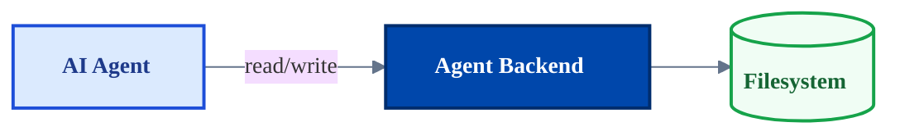
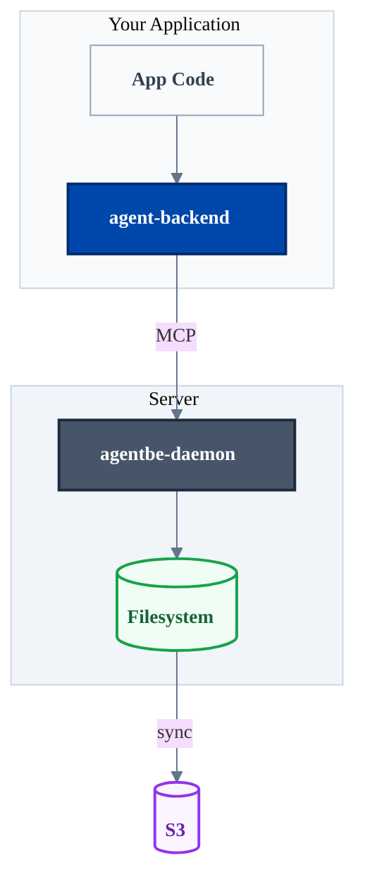
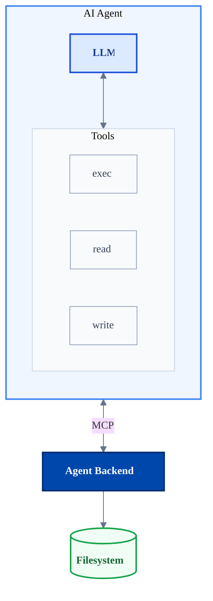

# Mermaid Style Guide

Consistent styling for Mermaid diagrams across Agent Backend documentation, aligned with the Deep Agents design system.

---

## Quick Start

Copy this init block and class definitions into your diagram:

```mermaid
%%{init: {'theme':'base', 'themeVariables': {
  'fontSize':'14px',
  'fontFamily':'system-ui, -apple-system, sans-serif',
  'lineColor':'#64748b',
  'primaryColor':'#f8fafc',
  'primaryTextColor':'#0f172a',
  'primaryBorderColor':'#cbd5e1'
}}}%%
```

Then add these class definitions at the bottom of your diagram:

```
classDef agent fill:#dbeafe,stroke:#1d4ed8,stroke-width:2px,color:#1e3a8a
classDef backend fill:#0047ab,stroke:#002d6d,stroke-width:2px,color:#ffffff
classDef storage fill:#f0fdf4,stroke:#16a34a,stroke-width:2px,color:#166534
classDef cloud fill:#faf5ff,stroke:#9333ea,stroke-width:2px,color:#6b21a8
classDef daemon fill:#475569,stroke:#1e293b,stroke-width:2px,color:#ffffff
classDef neutral fill:#f8fafc,stroke:#94a3b8,stroke-width:1px,color:#334155
classDef accent fill:#7c3aed,stroke:#5b21b6,stroke-width:2px,color:#ffffff
```

---

## Color Palette

Based on the Deep Agents blue-to-purple gradient, biased toward blue.

### Primary Colors

| Role | Fill | Stroke | Text | Usage |
|------|------|--------|------|-------|
| **Agent** | `#dbeafe` | `#1d4ed8` | `#1e3a8a` | AI agents, LLMs, user applications |
| **Backend** | `#0047ab` | `#002d6d` | `#ffffff` | Agent Backend core (emphasized) |
| **Storage** | `#f0fdf4` | `#16a34a` | `#166534` | Filesystems, databases, data stores |
| **Cloud** | `#faf5ff` | `#9333ea` | `#6b21a8` | Cloud services, S3, remote storage |
| **Daemon** | `#475569` | `#1e293b` | `#ffffff` | Server processes, daemons |
| **Neutral** | `#f8fafc` | `#94a3b8` | `#334155` | Generic nodes, containers |
| **Accent** | `#7c3aed` | `#5b21b6` | `#ffffff` | Highlights, emphasis |

### Semantic Mapping

- **Blue tones** → Core infrastructure (Agent Backend, APIs)
- **Green tones** → Data/storage (filesystems, databases)
- **Purple tones** → Cloud/external services (S3, remote)
- **Gray tones** → Neutral containers, daemons, infrastructure

---

## Class Definitions

### Full Copy-Paste Block

```
classDef agent fill:#dbeafe,stroke:#1d4ed8,stroke-width:2px,color:#1e3a8a
classDef backend fill:#0047ab,stroke:#002d6d,stroke-width:2px,color:#ffffff
classDef storage fill:#f0fdf4,stroke:#16a34a,stroke-width:2px,color:#166534
classDef cloud fill:#faf5ff,stroke:#9333ea,stroke-width:2px,color:#6b21a8
classDef daemon fill:#475569,stroke:#1e293b,stroke-width:2px,color:#ffffff
classDef neutral fill:#f8fafc,stroke:#94a3b8,stroke-width:1px,color:#334155
classDef accent fill:#7c3aed,stroke:#5b21b6,stroke-width:2px,color:#ffffff
```

### Application

```mermaid
class MyNode agent
class AnotherNode backend
```

Or inline:

```mermaid
Node["Label"]:::agent
```

---

## Typography

### Text Formatting

- Use `<b>text</b>` for emphasis in node labels
- Use `<i>text</i>` for secondary information
- Keep labels concise (2-4 words ideal)

```mermaid
Node["<b>Primary Label</b><br/><i>Secondary info</i>"]
```

### Init Block

Always include the theme initialization for consistent fonts:

```mermaid
%%{init: {'theme':'base', 'themeVariables': {
  'fontSize':'14px',
  'fontFamily':'system-ui, -apple-system, sans-serif',
  'lineColor':'#64748b'
}}}%%
```

---

## Node Shapes

### Standard Shapes

| Shape | Syntax | Usage |
|-------|--------|-------|
| Rectangle | `Node["Label"]` | Default, processes |
| Rounded | `Node("Label")` | Actions, operations |
| Stadium | `Node(["Label"])` | Start/end points |
| Cylinder | `Node[("Label")]` | Databases, storage |
| Diamond | `Node{"Label"}` | Decisions |
| Hexagon | `Node{{"Label"}}` | Preparation |
| Circle | `Node(("Label"))` | Connections |

### Recommended Usage

```mermaid
flowchart TB
    API["<b>API</b>"]           %% Rectangle for services
    FS[("<b>Filesystem</b>")]   %% Cylinder for storage
    S3[("<b>S3</b>")]           %% Cylinder for cloud storage
    Decision{"Deploy?"}          %% Diamond for decisions
```

---

## Subgraph Styling

### Subgraph Colors

Style subgraphs using the `style` directive:

```mermaid
subgraph Agent["Agent"]
    ...
end

style Agent fill:#eff6ff,stroke:#3b82f6,stroke-width:2px
```

### Recommended Subgraph Styles

```
style AgentSubgraph fill:#eff6ff,stroke:#3b82f6,stroke-width:2px
style BackendSubgraph fill:#f0fdf4,stroke:#22c55e,stroke-width:2px
style CloudSubgraph fill:#faf5ff,stroke:#a855f7,stroke-width:2px
style NeutralSubgraph fill:#f8fafc,stroke:#cbd5e1,stroke-width:1px
```

---

## Example Diagrams

### Simple Flow



### Architecture Overview



### Agent with Tools



---

## Edge Styling

### Labels

Keep edge labels short and descriptive:

```mermaid
A -->|"read/write"| B
A ==>|"sync"| C       %% Thick line for emphasis
A -.->|"optional"| D  %% Dotted for optional flows
```

### Edge Types

| Syntax | Appearance | Usage |
|--------|------------|-------|
| `-->` | Solid arrow | Primary flow |
| `==>` | Thick arrow | Emphasized flow |
| `-.->` | Dotted arrow | Optional/async |
| `---` | Solid line | Association |
| `-.-` | Dotted line | Weak association |

---

## Checklist

Before committing a diagram:

- [ ] Includes `%%{init:...}%%` theme block
- [ ] All nodes have appropriate `classDef` applied
- [ ] Labels use `<b>` for primary text
- [ ] Cylinders `[("...")]` used for storage nodes
- [ ] Subgraphs have `style` applied
- [ ] Edge labels are concise
- [ ] Colors follow the semantic mapping

---

## Design System Alignment

This style guide aligns with the Deep Agents design system:

| Design System | Mermaid Mapping |
|---------------|-----------------|
| Deep Blue `hsl(220, 100%, 35%)` | `backend` class (`#0047ab`) |
| Blue-Purple `hsl(260, 90%, 50%)` | `accent` class (`#7c3aed`) |
| Light Purple `hsl(280, 100%, 70%)` | `cloud` class stroke (`#9333ea`) |
| Text `#000000` | Dark text colors in classes |
| Gray scale | `neutral`, `daemon` classes |
| Green (storage) | `storage` class (`#16a34a`) |

The blue-to-purple gradient appears in the progression from `agent` → `backend` → `accent` → `cloud` classes.
